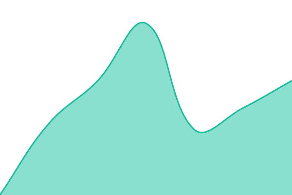
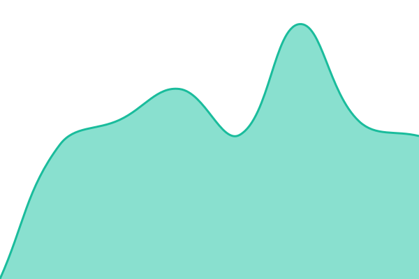
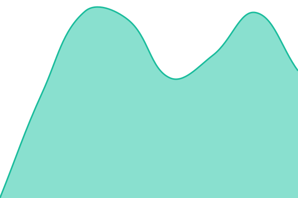
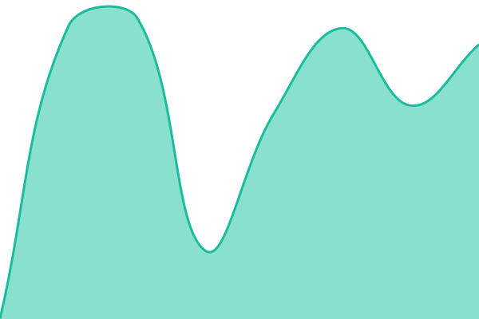
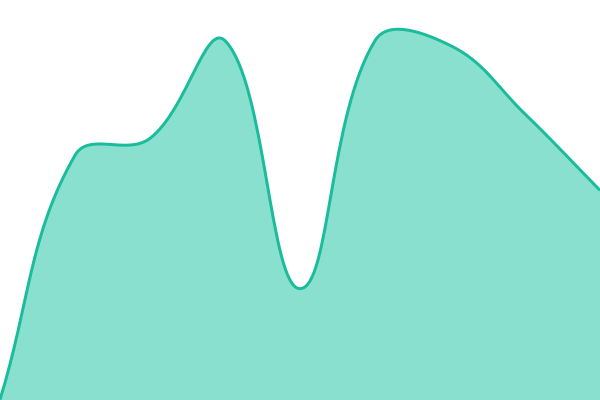
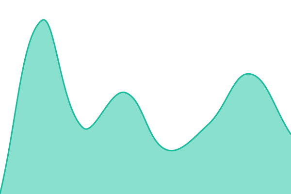
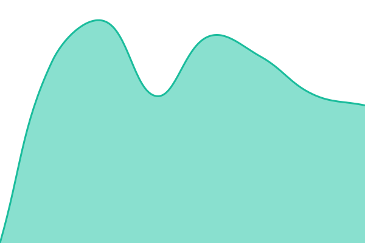

# [📈 Live Status](https://upptime.kodo.com): <!--live status--> **🟥 Complete outage**

<!--start: status pages-->
<!-- This summary is generated by Upptime (https://github.com/upptime/upptime) -->
<!-- Do not edit this manually, your changes will be overwritten -->
<!-- prettier-ignore -->
| URL | Status | History | Response Time | Uptime |
| --- | ------ | ------- | ------------- | ------ |
|  [Payouts UI](https://app.kodo.in) | 🟥 Down | [payouts-ui.yml](https://github.com/kodo-in/upptime/commits/HEAD/history/payouts-ui.yml) | 

 1121ms
     
 | 

<a href="https://upptime.kodo.com/history/payouts-ui">99.65%</a>
    

|  [Payouts API](https://api.kodo.in/health) | 🟥 Down | [payouts-api.yml](https://github.com/kodo-in/upptime/commits/HEAD/history/payouts-api.yml) | 

 1112ms
     
 | 

<a href="https://upptime.kodo.com/history/payouts-api">99.65%</a>
    

|  [P2P UI](https://app.kodo.com) | 🟥 Down | [p2-p-ui.yml](https://github.com/kodo-in/upptime/commits/HEAD/history/p2-p-ui.yml) | 

 857ms
     
 | 

<a href="https://upptime.kodo.com/history/p2-p-ui">99.65%</a>
    

|  [P2P Identity API](https://api.kodo.com/identity/health) | 🟥 Down | [p2-p-identity-api.yml](https://github.com/kodo-in/upptime/commits/HEAD/history/p2-p-identity-api.yml) | 

 965ms
     
 | 

<a href="https://upptime.kodo.com/history/p2-p-identity-api">99.66%</a>
    

|  [P2P form API](https://api.kodo.com/form/health) | 🟥 Down | [p2-p-form-api.yml](https://github.com/kodo-in/upptime/commits/HEAD/history/p2-p-form-api.yml) | 

 716ms
     
 | 

<a href="https://upptime.kodo.com/history/p2-p-form-api">99.66%</a>
    

|  [Treasury API](https://api.kodo.com/north/ready) | 🟥 Down | [treasury-api.yml](https://github.com/kodo-in/upptime/commits/HEAD/history/treasury-api.yml) | 

 662ms
     
 | 

<a href="https://upptime.kodo.com/history/treasury-api">99.52%</a>
    

|  [Treasury UI](https://north.kodo.com/auth/login) | 🟥 Down | [treasury-ui.yml](https://github.com/kodo-in/upptime/commits/HEAD/history/treasury-ui.yml) | 

 1134ms
     
 | 

<a href="https://upptime.kodo.com/history/treasury-ui">100.00%</a>
    

<!--end: status pages-->

[**Visit our status website →**](https://upptime.kodo.com)
