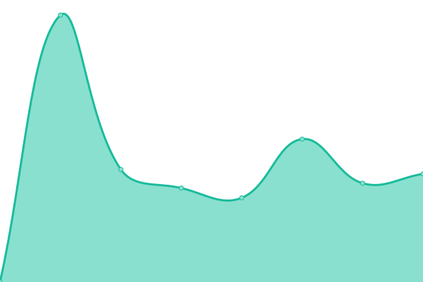

# [📈 Live Status](https://upptime.kodo.com): <!--live status--> **🟩 All systems operational**

This repository contains the open-source uptime monitor and status page for [Kodo](https://www.kodo.com/), powered by [Upptime](https://github.com/upptime/upptime).

With [Upptime](https://upptime.js.org), you can get your own unlimited and free uptime monitor and status page, powered entirely by a GitHub repository. We use [Issues](https://github.com/kodo-in/upptime/issues) as incident reports, [Actions](https://github.com/kodo-in/upptime/actions) as uptime monitors, and [Pages](https://upptime.kodo.com) for the status page.

<!--start: status pages-->
<!-- This summary is generated by Upptime (https://github.com/upptime/upptime) -->
<!-- Do not edit this manually, your changes will be overwritten -->
<!-- prettier-ignore -->
| URL | Status | History | Response Time | Uptime |
| --- | ------ | ------- | ------------- | ------ |
|  [Payouts UI](https://app.kodo.in) | 🟩 Up | [payouts-ui.yml](https://github.com/kodo-in/upptime/commits/HEAD/history/payouts-ui.yml) | 

 843ms
     
 | 

<a href="https://upptime.kodo.com/history/payouts-ui">100.00%</a>
    

|  [Payouts API](https://api.kodo.in/health) | 🟩 Up | [payouts-api.yml](https://github.com/kodo-in/upptime/commits/HEAD/history/payouts-api.yml) | 

 2003ms
     
 | 

<a href="https://upptime.kodo.com/history/payouts-api">100.00%</a>
    

|  [P2P UI](https://app.kodo.com) | 🟩 Up | [p2-p-ui.yml](https://github.com/kodo-in/upptime/commits/HEAD/history/p2-p-ui.yml) | 

 892ms
     
 | 

<a href="https://upptime.kodo.com/history/p2-p-ui">100.00%</a>
    

|  [P2P Identity API](https://api.kodo.com/identity/health) | 🟩 Up | [p2-p-identity-api.yml](https://github.com/kodo-in/upptime/commits/HEAD/history/p2-p-identity-api.yml) | 

 881ms
     
 | 

<a href="https://upptime.kodo.com/history/p2-p-identity-api">100.00%</a>
    

|  [P2P form API](https://api.kodo.com/form/health) | 🟩 Up | [p2-p-form-api.yml](https://github.com/kodo-in/upptime/commits/HEAD/history/p2-p-form-api.yml) | 

 278ms
     
 | 

<a href="https://upptime.kodo.com/history/p2-p-form-api">100.00%</a>
    

<!--end: status pages-->

[**Visit our status website →**](https://upptime.kodo.com)

## 📄 License

- Powered by: [Upptime](https://github.com/upptime/upptime)
- Code: [MIT](./LICENSE) © [Anand Chowdhary](https://anandchowdhary.com), supported by [Pabio](https://pabio.com)
- Data in the `./history` directory: [Open Database License](https://opendatacommons.org/licenses/odbl/1-0/)
