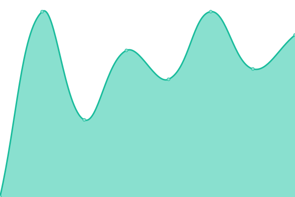
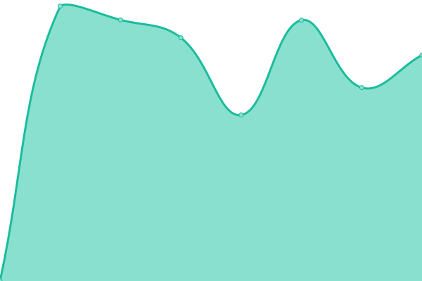

# [📈 Live Status](https://upptime.kodo.com): <!--live status--> **🟩 All systems operational**

<!--start: status pages-->
<!-- This summary is generated by Upptime (https://github.com/upptime/upptime) -->
<!-- Do not edit this manually, your changes will be overwritten -->
<!-- prettier-ignore -->
| URL | Status | History | Response Time | Uptime |
| --- | ------ | ------- | ------------- | ------ |
|  [Payouts UI](https://app.kodo.in) | 🟩 Up | [payouts-ui.yml](https://github.com/kodo-in/upptime/commits/HEAD/history/payouts-ui.yml) | 

 765ms
     
 | 

<a href="https://upptime.kodo.com/history/payouts-ui">100.00%</a>
    

|  [Payouts API](https://api.kodo.in/health) | 🟩 Up | [payouts-api.yml](https://github.com/kodo-in/upptime/commits/HEAD/history/payouts-api.yml) | 

 1165ms
     
 | 

<a href="https://upptime.kodo.com/history/payouts-api">100.00%</a>
    

|  [P2P UI](https://app.kodo.com) | 🟩 Up | [p2-p-ui.yml](https://github.com/kodo-in/upptime/commits/HEAD/history/p2-p-ui.yml) | 

 781ms
     
 | 

<a href="https://upptime.kodo.com/history/p2-p-ui">100.00%</a>
    

|  [P2P Identity API](https://api.kodo.com/identity/health) | 🟩 Up | [p2-p-identity-api.yml](https://github.com/kodo-in/upptime/commits/HEAD/history/p2-p-identity-api.yml) | 

 781ms
     
 | 

<a href="https://upptime.kodo.com/history/p2-p-identity-api">100.00%</a>
    

|  [P2P form API](https://api.kodo.com/form/health) | 🟩 Up | [p2-p-form-api.yml](https://github.com/kodo-in/upptime/commits/HEAD/history/p2-p-form-api.yml) | 

 238ms
     
 | 

<a href="https://upptime.kodo.com/history/p2-p-form-api">100.00%</a>
    

<!--end: status pages-->

[**Visit our status website →**](https://upptime.kodo.com)
